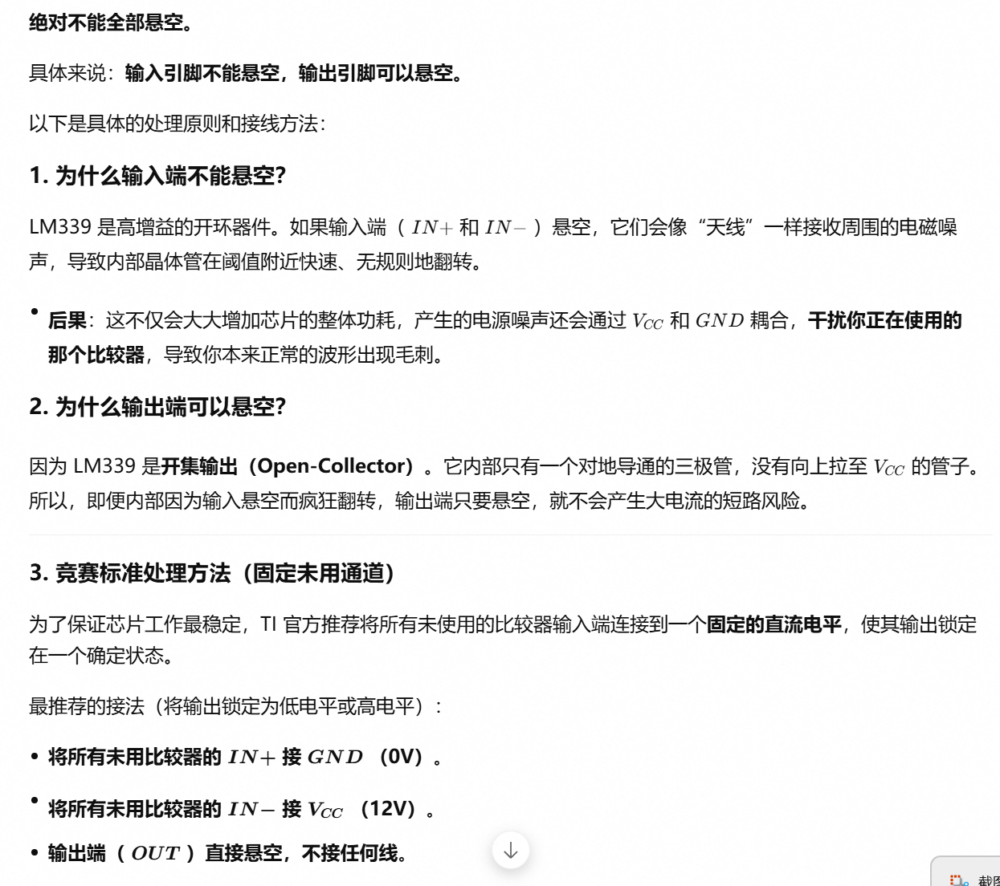

现在我已经完整获取了这份 53 页 LM339 数据手册的所有页面内容。下面我从竞赛实战角度，逐章节、逐页为你分析哪些是"必读"、哪些是"备查"、哪些可以"直接跳过"。

------

## 一、整本手册的结构地图（53页总览）

| 页码      | 章节                                     | 内容概要                                 | 竞赛重要性 |
| --------- | ---------------------------------------- | ---------------------------------------- | ---------- |
| **1**     | Features / Description                   | 芯片简介、简化原理图、系列型号对比       | ★★★ 必读   |
| **2**     | Table of Contents                        | 目录                                     | ★☆☆ 跳过   |
| **3**     | Other Versions                           | 军用/航天等合格版本列表                  | ☆☆☆ 跳过   |
| **4**     | Pin Configuration                        | 引脚排列图（14脚/16脚封装）              | ★★★ 必读   |
| **5**     | Abs Max Ratings + Thermal                | 绝对最大额定值 + 热阻参数                | ★★★ 必读   |
| **6**     | ESD Ratings + Recommended Op. Conditions | ESD等级 + 推荐工作条件                   | ★★☆ 备查   |
| **7-12**  | Electrical / Switching Characteristics   | 各子型号的详细电气参数表                 | ★★☆ 按需查 |
| **13-18** | Typical Characteristics                  | 典型特性曲线图（约20幅）                 | ★★☆ 备查   |
| **19-22** | Detailed Description + Applications      | 原理详述、输入/输出行为、应用电路        | ★★★ 核心   |
| **23**    | Device Support / Related Links           | 文档链接                                 | ☆☆☆ 跳过   |
| **24-25** | Revision History                         | 版本修订记录                             | ☆☆☆ 跳过   |
| **26-52** | Mechanical / Packaging                   | 封装尺寸图、焊盘设计、钢网设计、卷带信息 | ☆☆☆ 跳过   |
| **53**    | Important Notice                         | 法律声明                                 | ☆☆☆ 跳过   |

------

## 二、逐层详解：哪些信息值得看、怎么看

### 第1页 — 必读（30秒速览）

**位置**：第1页上半部分

- Features 列表

  ：快速抓住芯片核心卖点——

  - 供电范围宽（单电源 2V~36V，双电源 ±1V~±18V）
  - 低供电电流（典型 250μA，与负载无关）
  - **开集输出（Open-collector）**——这是最关键的信息，意味着输出端必须接上拉电阻
  - 输入共模范围包含地（GND）
  - 差分输入阻抗高

- **简化原理图**（第1页中下部 Figure 1-1）：一眼看清内部4路比较器的基本拓扑——每路比较器由差分输入对（PNP）→ 电流镜 → 开集输出NPN组成。**这个图是理解所有后续应用电路的根基。**

**可忽略**：页面底部的"Applications"列表和器件比较表（比赛时你已经拿到芯片了，不需要选型对比）。

------

### 第4页 — 必读（引脚图，比赛第一个看的图）

**位置**：第4页，Figure 5-1 和 Figure 5-2

- Figure 5-1

  ：14脚 DIP/SOIC/TSSOP 封装的引脚排列（Top View）

  - Pin 3 = VCC，Pin 12 = VEE/GND
  - 4路比较器的 IN+、IN-、OUT 分别标注

- **Figure 5-2**：16脚 WQFN 封装引脚图（多一个热焊盘，NC脚）

- **Pin Functions 表格**：每个引脚的功能定义

**比赛时操作**：拿到芯片后第一件事就是翻到这一页，确认你手上的封装是哪种，然后对照引脚图焊接。比赛大概率发 DIP-14 封装，所以 **Figure 5-1 是最关键的图**。

------

### 第5页 — 必读（别烧芯片）

**位置**：第5页上半部分，"6.1 Absolute Maximum Ratings"

- **供电电压 VCC**：最大 36V（B版本38V）—— 比赛中别用超过这个值的电源
- **差分输入电压 VID**：最大 ±36V
- **输入电压范围**：VEE-0.3V 到 VCC+0.3V（注意 B 版本可超出共模范围）
- **输出电压**：最大 36V
- **输出灌电流（Output Sink Current）**：最大 20mA —— 这决定了上拉电阻的最小值

**位置**：第5页下半部分，"Thermal Information"

- **结温 Tj**：最大 150°C
- **热阻 θJA**：PDIP封装约 84.6°C/W（了解即可，比赛中一般不涉及热计算）

**比赛时操作**：主要看供电电压上限和输出电流上限，防止设计电路时过压/过流烧毁芯片。

------

### 第6页 — 备查

**ESD Ratings**：了解芯片抗静电能力，比赛中注意防静电即可，不需要记数值。

**Recommended Operating Conditions**：

- 供电电压范围（B版本：2V~36V，老版本：2V~30V）
- 共模输入电压范围（VEE 到 VCC-1.5V）—— **注意共模范围不包括正电源轨**
- 工作温度范围（LM339：0°C~70°C）

------

### 第7-12页 — 按需查阅（电气特性参数表）

这6页分别是不同子型号（LM339B、LM2901B、LM139/A、LMx39/A、LM2901系列）的电气参数表。**比赛时你只需看你对应型号那一页**。

**核心关注参数**（以第7页 LM339B 为例）：

| 参数           | 符号  | 典型值                 | 含义                |
| -------------- | ----- | ---------------------- | ------------------- |
| 输入失调电压   | VIO   | 3mV (typ) / 25mV (max) | 比较精度上限        |
| 输入偏置电流   | IIB   | -3.5nA                 | 对输入阻抗的要求    |
| 输入失调电流   | IIO   | 3nA                    | 两输入端电流差      |
| 共模抑制比     | CMRR  | 80dB                   | 对共模噪声的抑制    |
| 输出电压低电平 | VOL   | 0.25V (max)            | 输出"0"时的实际电压 |
| 输出漏电流     | IOH   | 1μA (max)              | 开集截止时的漏电流  |
| 电压增益       | AVD   | 200V/mV                | 开环增益，极大      |
| 响应时间       | tresp | 0.3μs                  | 翻转速度            |

**比赛时操作**：不需要逐行背，但以下3个参数必须心中有数：

1. **VIO（输入失调电压）**—— 决定你设计比较器时的最小分辨电压
2. **VOL（输出低电平）**—— 不是0V，是约0.25V
3. **响应时间** —— 决定你能处理的信号频率上限

------

### 第13-18页 — 备查（典型特性曲线）

共约20幅图（Figure 6-1 到 Figure 6-24），展示各种参数随温度/电压/频率的变化。

**比赛中值得参考的图**：

- **电源电流 vs 供电电压**（Figure 6-1）：了解功耗
- **输入失调电压 vs 温度**（Figure 6-5/6-13）：评估温度漂移
- **响应时间 vs 过驱动电压**（Figure 6-9/6-10）：了解翻转速度与信号幅度的关系
- **增益/相位 vs 频率**（Figure 6-17/6-18）：如果在Spice中做AC仿真需要参考

**可忽略**：大部分曲线在竞赛中不需要，只有当你的仿真结果异常时才翻来看对比。

------

### 第19-22页 — 核心重点（Detailed Description + Applications）

这是整本手册**最有价值的部分**，比赛时应该花最多时间阅读。

**第19页**（7.1 Overview + 7.2 Functional Block Diagram）：

- **Figure 7-1 功能框图**：完整画出内部电路——差分输入对、电流镜、输出级。**必须看懂**，这是你理解比较器行为的根基。
- 关键文字：解释了为什么输出是开集结构，为什么需要上拉电阻

**第20-21页**（8.1 Application Information）：

- **输入电压情况与输出结果的对应关系**（4种情况）—— 这是比较器行为的完整描述
- **最小过驱动电压（Minimum Overdrive Voltage）**—— 必须大于VIO才能可靠翻转
- **开集输出注意事项**：上拉电阻的计算方法

**第22页**（Application Curves + Layout）：

- **Figure 8-2/8-3 响应时间 vs 输出电压**：正/负跳变的波形
- **8.3 Power Supply Recommendations**：电源旁路电容的建议
- **8.4 Layout Guidelines**：PCB布线建议——比赛用洞洞板，重点看"电源加旁路电容"的建议即可

------

### 第23-25页 — 全部跳过

Related Links（网页链接）、Revision History（修订记录）对比赛毫无用处。

------

### 第26-52页 — 全部跳过（封装/包装/订购信息）

这27页包含：

- 可订购型号清单（第27-31页）
- 卷带/管材包装尺寸（第32-37页）
- 各种封装的机械尺寸图（PDIP/TSSOP/WQFN/SOIC/SOP/SSOP）（第38-52页）
- 焊盘设计、钢网设计（Board Layout / Stencil Design）

**原因**：比赛用的是DIP封装+洞洞板，不涉及PCB制板、回流焊、钢网等工艺。你只需要看第4页的引脚图就够了。

------

### 第53页 — 跳过

TI法律免责声明。

------

## 三、竞赛速查策略总结

拿到任何TI芯片手册时，按以下顺序检索，可在 **5分钟内** 掌握芯片核心用法：

| 步骤 | 翻到哪里                      | 看什么                                         | 时间 |
| ---- | ----------------------------- | ---------------------------------------------- | ---- |
| 1    | 第1页                         | Features + 简化原理图 → 确认芯片类型和核心特性 | 30s  |
| 2    | Pin Configuration 页          | 引脚图 → 确认电源、地、输入、输出引脚位置      | 1min |
| 3    | Abs Max Ratings 页            | 供电上限、电流上限 → 防止烧芯片                | 30s  |
| 4    | Detailed Description 页       | 功能框图 + 工作原理 → 理解内部结构             | 2min |
| 5    | Application Information 页    | 典型应用电路 + 注意事项 → 直接拿来设计电路     | 2min |
| 6    | Electrical Characteristics 页 | 找对应型号的表，重点看VIO、VOL、响应时间       | 1min |

**直接跳过的内容**（节省70%时间）：

- 目录、修订历史、法律声明
- 所有封装/包装/订购信息（约占手册后半部分）
- 其他子型号的参数表（只看你自己的型号）
- 大部分典型特性曲线（除非仿真异常时对比）
- ESD等级、热阻详细参数（了解概念即可）

------

## 四、针对LM3339的"必记要点"（可直接带入仿真）

1. **开集输出** → 必须在输出端和VCC之间接上拉电阻（典型1kΩ~10kΩ），否则输出永远悬空
2. **共模范围**：VEE 到 VCC-1.5V，不包含正电源轨
3. **输入失调电压**：典型3mV，最大25mV → 仿真时注意这个误差
4. **响应时间**：约0.3μs（过驱动100mV时）→ 最高处理几百kHz的信号
5. **供电灵活**：2V~36V单电源，或±1V~±18V双电源
6. **输入偏置电流极小**（nA级）→ 对输入源阻抗不敏感，但高阻抗分压网络仍可忽略其影响

希望这个分析能帮你在比赛中快速定位关键信息。如果你准备好了，接下来我们可以进入 Spice for TI 的仿真环节，我可以帮你设计具体的比较器电路并进行仿真验证。

好的，结合你这个具体仿真电路，我完全换一个视角来重新分析。

------

## 从电路倒推：你需要在手册中找什么

### 电路条件提取

| 电路参数                        | 数值               | 对应手册参数           |
| ------------------------------- | ------------------ | ---------------------- |
| VCC = 12V（VINN2）              | 供电电压           | **推荐工作条件**       |
| VEE = GND                       | 单电源供电         | **供电范围**           |
| IN+ = 5V偏置 + 100mV/100kHz正弦 | 信号幅值小、频率中 | **共模范围、响应时间** |
| IN- = 5V 固定直流               | 参考电压           | **输入失调电压**       |
| OUT 加 R3=10k 上拉到 VCC        | 开集输出           | **输出特性**           |

------

### 必须查的参数（按优先级排序）

#### ① 共模输入电压范围（Input Common-Mode Voltage Range）

> **手册定位**：第7页 Electrical Characteristics 表中 "Input common-mode voltage range"

你的两个输入都在 **5V 附近**，VCC=12V。

- LM339 的共模范围：**0 ~ (VCC - 1.5V)**，即 0~10.5V
- **判断**：5V 完全在范围内 ✅
- ⚠️ **竞赛易错**：如果参考电压设在 11V 以上就会越界，比较器不再正常工作

#### ② 开集输出 → 必须加上拉电阻（核心认知）

> **手册定位**：第19页 "Output" 段落 + 第4页引脚定义中的 "OC_OUT" 标注

- OC_OUT = **Open-Collector Output**
- 输出管脚内部是一个 **NPN 三极管的集电极悬空**，只能拉低到 GND，无法主动拉高
- **必须外接上拉电阻**（你的 R3=10k 就是这个作用）
- ⚠️ **竞赛易错**：忘记加上拉电阻 → 输出永远浮空，探针读不到高电平

**上拉电阻取值**（手册第19页有说明）：

- 太大（如 100k）→ 上升时间慢，100kHz 信号可能失真
- 太小（如 1k）→ 静态电流大、功耗高
- **10k 是经验值，仿真和实物都适用**

#### ③ 响应时间（Response Time）

> **手册定位**：第7页 "Response time" 或第12页曲线

你的信号频率 = **100kHz**（周期 10μs，半周期 5μs）

- LM339 典型响应时间：**1.3μs**（VCC=5V 时），12V 时更快约 **300ns**
- **判断**：300ns << 5μs，完全够用 ✅
- ⚠️ **竞赛易错**：如果信号频率到 1MHz 以上（半周期500ns），LM339 就来不及响应了

#### ④ 输入失调电压（Input Offset Voltage）

> **手册定位**：第7页 "Input offset voltage"

- LM339 典型值：**2mV**，最大 **5~7mV**
- 你的信号幅值只有 **100mV**
- **影响**：实际翻转阈值不是精确的 5.000V，而是在 4.993V ~ 5.007V 之间漂移
- 对 100mV 幅值信号来说误差约 **5%~7%**，可接受
- ⚠️ **竞赛注意**：如果信号幅值缩小到 10mV 量级，失调电压就会严重干扰比较结果

#### ⑤ 电源电压范围（Supply Voltage Range）

> **手册定位**：第1页 Features 或第6页 Recommended Operating Conditions

- LM339 供电范围：**2V ~ 36V**
- 你的 VCC=12V → 完全在范围内 ✅

#### ⑥ 输出饱和电压（Output Low-Level Voltage）

> **手册定位**：第7页 "Output low-level voltage"

- 当输出为低电平时，OC 管饱和压降典型值 **< 250mV**（在 4mA 灌电流下）
- 说明"低电平"不是精确的 0V，而是约 0.1~0.25V
- **竞赛影响**：驱动后级 TTL/CMOS 电路时需注意低电平容限

------

### 这个电路可以忽略的手册内容

| 忽略内容              | 原因                                                   |
| --------------------- | ------------------------------------------------------ |
| 第13-18页所有特性曲线 | 你做瞬态分析，不需要深究温度漂移、电源抑制比等二级特性 |
| 第8-12页开关特性细节  | 100kHz 远低于芯片极限，不需要抠传播延迟的 ps 级差异    |
| 第26-52页封装尺寸     | 洞洞板插 DIP 封装，不需要画 PCB 焊盘                   |
| 第3页其他子型号对比   | 比赛发什么用什么，不存在选型问题                       |
| 第5页绝对最大额定值   | 你的供电和信号都在正常范围内，不会触碰到破坏极限       |

------

### 总结：比赛时查同类比较器的"五步法"

当你拿到一本新的比较器手册时，按以下顺序快速翻：

1. **第1页 Features** → 确认是不是开集输出（Open-Collector/Open-Drain）
2. **第4页 Pin Configuration** → 确认引脚排列（防止接反）
3. **第6页 Recommended Operating Conditions** → 供电范围 + 共模输入范围
4. **第7页 Electrical Characteristics** → 响应时间 + 失调电压 + 输出饱和电压
5. **第19页 Detailed Description** → 看有没有特殊行为（如迟滞、使能引脚等）

整个过程控制在 **3 分钟以内**，其余 50 页直接跳过。

------

需要我帮你把这个分析框架扩展到其他常见比赛芯片（如 LM324 运放、NE555 定时器等）上吗？

要通过这个具体电路和瞬态分析（Transient Analysis）得到最终的输出电压，我们需要**将电路的输入条件与手册（Datasheet）中的核心参数一一对应**。

以下是具体的推导和计算步骤，这也是你在比赛中拿到任意芯片手册后，分析输出波形时的标准思维路径：

------

### 一、 提取电路输入状态

根据你提供的仿真图，输入信号如下：

- **参考端 ($IN-$)**：直流电压 $V_{IN-} = 5\text{V}$。
- - 
- 

------

### 二、 结合手册，分段计算输出电压

LM339 是一个**开集输出（Open-Collector）**比较器，它的输出电压只有两种状态：**高电平（内部三极管截止）** 和 **低电平（内部三极管饱和导通）**。

#### 

- **工作物理状态**：此时比较器内部输出管（NPN三极管）处于**截止（OFF）**状态。
- 
- 

#### 

- **工作物理状态**：此时内部输出管**饱和导通（ON）**，相当于输出端通过一个极小的等效电阻接地。

- 查找手册关键参数

  ：

  在手册的 

  Electrical Characteristics

   表中，找到 

  Output Saturation Voltage ($V_{OL}$)

   参数：

  - 

- - 

- 

------

### 三、 瞬态仿真（Transient Analysis）的预期波形

根据上述计算，在 SPICE 仿真软件中观察输出探针（OUT）的瞬态波形，你应该看到：

1. 

2. **高电平幅值**：恒定在 。

3. **低电平幅值**：非常接近地，约在  之间。

4. 

5. 翻转点延迟（传播延迟 $t_{pd}$）

   ：

   - 手册中 *Response Time* 典型值为 $1.3\mu\text{s}$。
   - 

------

### 四、 比赛实战避坑指南（基于此电路）

1. **上拉电阻不能省**：LM339 是开集输出。如果没有 $R3$，输出在需要变高时会处于“高阻态（浮空）”，仿真可能直接报错或显示一条直线。

2. 共模电压范围检查

   ：

   - 手册规定共模电压范围：$0 \sim V_{CC} - 1.5\text{V}$（即 $0 \sim 10.5\text{V}$）。
   - 

3. 

需要我帮你把这种比较器电路的瞬态仿真关键观测点整理成一份备赛速查清单吗？

