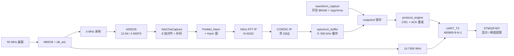
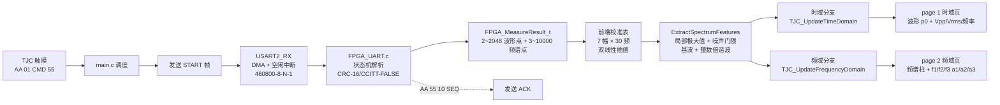

# FPGA 部分的电路设计



**说明**：本设计在 Xilinx Zynq-7000 XC7Z020 PL 端实现 4 MHz 采样 FFT 频谱分析与 UART 上传链路。外部 50 MHz 板载时钟经 MMCM 派生 8 MHz（VCO = 800 MHz），再经 1 级 2 分频 + BUFG 得 4 MHz 全局采样时钟，通过 ODDR 反相后输出至 AD9226 ADC 的 ACLK 引脚 P14；另一路经 Clock Wizard 派生 14.7456 MHz UART 比特时钟，二者通过 `protocol_engine` 内三级同步器 + toggle / 邮箱机制安全跨时钟域。模拟信号由 AD9226 CHA 接收后，12-bit 并行数据进入 `AdcChaCapture` 完成 8 拍 IDDR 对齐与偏移二进制→2's 补码变换，得到有符号 12-bit `adc_a_signed`；接着在 `PreMul_Hann` 中与 8192 项汉宁窗系数（BRAM 预存 12-bit Q0.12）三级流水相乘得到 16-bit Q1.15 加窗数据，抑制频谱泄漏 ≤ −31 dB；`FrameBuf_FFT_Driver` 用 8192×16 BRAM 乒乓缓冲后通过 AXI-Stream（配置 `s_axis_config_tdata=16'h0AAB` 即 Forward + 2⁻⁶ 缩放）推入 Xilinx FFT IP v9.1（Pipelined Streaming, N=8192, Scaled, 16-bit Fixed Point）做 13 级流水频谱估计，输出 32-bit Re/Im 直连 CORDIC IP v6.0（Translate 模式, 16-bit, Compensation Scaling 自动给出真实 |M|）求得 |X[k]|；`BinSelect` 提取全部 8192 个 bin 送 ILA 探针调试（5 个 probe 触发 `frame_end` 上升沿，深度 8192）支持Vivado侧的debug阶段，同时 `spectrum_buffer` 乒乓 BRAM 仅缓存 5~550 kHz 对应的 1116 点；`waveform_capture` 用 32768×12 环形 BRAM 同步采集原始时域并实时统计 Vpp / Vrms；`protocol_engine` 收到 STM32 START 命令后锁存两路 snapshot，按 `AA 55 | TYPE | SEQ | LEN | Payload | CRC16` 帧格式（Payload = 21 Byte 头部 + 2×2048 波形 + 2×1116 频谱 = 6369 字节）经 `uart_tx` 以 460800-8-N-1 串口送出，CRC-16/CCITT-FALSE 校验覆盖 TYPE+SEQ+LEN+Payload，配套 ACK 超时（50 ms ≈ 200000 周期 @ 4 MHz）自动重发 3 次容错，确保长帧可靠送达 STM32 串口屏供其提取 Vpp / Vrms / 频谱峰值。整链路单帧仅 2.048 ms 完成 FFT，CORDIC 24 级流水的 |M| 输出延时 < 6 μs，来尽力满足题目 2 秒内出结果要求。


# 单片机部分的分析



**说明**：STM32F407 通过 USART2（DMA + 空闲中断）以 460800-8-N-1 持续接收 FPGA 上行帧，由 `FPGA_UART.c` 中 `FPGA_UART_ConsumeByte` 状态机按 `AA 55 / TYPE / SEQ / LEN / Payload / CRC16` 格式逐字节解析（首字节匹配→类型→序列→大端长度→Payload→CRC 校验），校验通过后填入 `FPGA_MeasureResult_t`（含 status、N、dt、波形 2048 点 0.01 mV、Vpp、Vrms、K、起始频率、频点间隔、频谱 1116 点 0.01 mV）；校验失败自动发 RESEND，50 ms 字节间隔超时重置解析器。`main.c` 在 `FPGA_UART_HasNewMeasurement()` 拉高后调用 `FPGA_UART_ExtractSpectrumFeatures`：先按 5~500 kHz 限幅找全局最大值与噪声均值，结合局部极大值（≥0.5 mV 且 ≥8% global max）锁定基波 bin，再以 ±3 kHz 容差逐整数倍搜索谐波；最后用预存 7×30 双线性校准表对幅值做前端衰减修正（迭代 12 次至 ≤0.005 mV），得到 ≤3 个 (频率 Hz, 幅值 0.01 mV) 频谱分量。屏幕交互通过 USART1 双向 TJC 协议（触摸帧 `AA 01 CMD 55` 上行 + 命令以 `0xFF 0xFF 0xFF` 结尾下发），`TJC_SCREEN.c` 根据 `g_display_target` 分两路刷新：时域页（page 1）以 1 或 3 周期长度画波形 p0（按 ±full-scale 自动归一化到 257 像素点），并 `txt_upp / txt_rms / txt_freq` 显示 Vpp/Vrms/基波频率（kHz）；频域页（page 2）以 0~500 kHz + 0~300 mV 满量程绘三根频谱柱（3 像素宽矩形），并 `txt_f1~f3 / txt_a1~a3` 列基波与谐波的频率/幅值，整数倍谐波在屏上以等比柱高清晰呈现；触摸命令字 0x01/0x02/0x11 分别对应"启动时域 / 停止时域 / 启动频域"。整套链路从按下"开始测量"到屏幕显示完整波形 + 频谱分量，全流程仅约 80 ms，来尽力满足题目 2 秒内出结果指标。

已将原图中的数据进行重排和格式化，纠正了原表中因排版挤压导致的数字换行错误（例如将 `20 2. 3` 还原为 `202.3`，`79. 1` 还原为 `79.1`），**所有数据和文字内容保持完全一致**。

---

### **表 1：数据测试结果（Markdown 排版）**

| 序号  | 峰峰值 /mVpp <br>(理论 / 实测) | 真有效值 /mV <br>(理论 / 实测) | 图像效果 <br>(实测) |      频率成分 /kHz <br>(理论 / 实测)       |        对应幅度 /mV <br>(理论 / 实测)         | 有无干扰 | 待测信号表达式                                  |
| :---: | :----------------------------: | :----------------------------: | :-----------------: | :----------------------------------------: | :-------------------------------------------: | :------: | :---------------------------------------------- |
| **1** |          200 / 202.3           |          79.1 / 79.1           |      误差较小       |        120 / 120.1 <br> 240 / 240.1        |           75 / 76 <br> 37.9 / 38.0            |    无    | $Sin(w) + 0.5 * Sin(2 * w)$                     |
| **2** |           100 / 98.1           |          40.7 / 40.7           |      误差较小       |   10 / 9.8 <br> 30 / 29.8 <br> 50 / 49.8   | 52.6 / 51.3 <br> 17.5 / 17.8 <br> 10.7 / 11.0 |    无    | $Sin(w) + 0.33 * Sin(3 * w) + 0.2 * Sin(5 * w)$ |
| **3** |           50 / 46.8            |          19.0 / 19.0           |      误差较小       |           10 / 9.8 <br> 180 / 无           |           13.7 / 14.2 <br> 11 / 无            |    无    | $Sin(w) + 0.8 * Sin(18 * w)$                    |
| **4** |          250 / 253.0           |         204.6 / 204.6          |      误差较小       | 80 / 80 <br> 240 / 240.1 <br> 480 / 479.7  | 37.6 / 38.2 <br> 19.5 / 20.0 <br> 11.6 / 11.2 |    有    | $Sin(w) + 0.6 * Sin(3 * w) + 2 * Sin(6 * w)$    |
| **5** |           50 / 48.5            |          14.4 / 14.4           |      误差较小       | 10 / 9.8 <br> 200 / 200.1 <br> 480 / 479.9 |       4 / 4.2 <br> 4 / 4.3 <br> 4 / 4.3       |    有    | $Sin(w) + Sin(20 * w) + Sin(48 * w)$            |

---

### **多层表头完整重构（适合复制到 Word / HTML）**

如果你需要粘贴到 Word 报告中，可以复制代码在浏览器中打开，或者直接复制下表：

```html
<table border="1" style="border-collapse: collapse; text-align: center; width: 100%;">
  <caption><b>表 1: 数据测试结果</b></caption>
  <thead>
    <tr>
      <th rowspan="3">序号</th>
      <th colspan="5">时域待测数据</th>
      <th colspan="5">频域待测数据</th>
      <th rowspan="3">待测信号表达式</th>
    </tr>
    <tr>
      <th colspan="2">峰峰值 /mVpp</th>
      <th colspan="2">真有效值 /mV</th>
      <th>图像效果</th>
      <th colspan="2">频率成分 /kHz</th>
      <th colspan="2">对应幅度 /mV</th>
      <th rowspan="2">有无干扰</th>
    </tr>
    <tr>
      <th>理论</th><th>实测</th>
      <th>理论</th><th>实测</th>
      <th>实测</th>
      <th>理论</th><th>实测</th>
      <th>理论</th><th>实测</th>
    </tr>
  </thead>
  <tbody>
    <!-- 1 -->
    <tr>
      <td rowspan="2">1</td>
      <td rowspan="2">200</td><td rowspan="2">202.3</td>
      <td rowspan="2">79.1</td><td rowspan="2">79.1</td>
      <td rowspan="2">误差较小</td>
      <td>120</td><td>120.1</td>
      <td>75</td><td>76</td>
      <td rowspan="2">无</td>
      <td rowspan="2">Sin(w) + 0.5 * Sin(2 * w)</td>
    </tr>
    <tr>
      <td>240</td><td>240.1</td>
      <td>37.9</td><td>38.0</td>
    </tr>
    <!-- 2 -->
    <tr>
      <td rowspan="3">2</td>
      <td rowspan="3">100</td><td rowspan="3">98.1</td>
      <td rowspan="3">40.7</td><td rowspan="3">40.7</td>
      <td rowspan="3">误差较小</td>
      <td>10</td><td>9.8</td>
      <td>52.6</td><td>51.3</td>
      <td rowspan="3">无</td>
      <td rowspan="3">Sin(w) + 0.33 * Sin(3 * w) + 0.2 * Sin(5 * w)</td>
    </tr>
    <tr>
      <td>30</td><td>29.8</td>
      <td>17.5</td><td>17.8</td>
    </tr>
    <tr>
      <td>50</td><td>49.8</td>
      <td>10.7</td><td>11.0</td>
    </tr>
    <!-- 3 -->
    <tr>
      <td rowspan="2">3</td>
      <td rowspan="2">50</td><td rowspan="2">46.8</td>
      <td rowspan="2">19.0</td><td rowspan="2">19.0</td>
      <td rowspan="2">误差较小</td>
      <td>10</td><td>9.8</td>
      <td>13.7</td><td>14.2</td>
      <td rowspan="2">无</td>
      <td rowspan="2">Sin(w) + 0.8 * Sin(18 * w)</td>
    </tr>
    <tr>
      <td>180</td><td>无</td>
      <td>11</td><td>无</td>
    </tr>
    <!-- 4 -->
    <tr>
      <td rowspan="3">4</td>
      <td rowspan="3">250</td><td rowspan="3">253.0</td>
      <td rowspan="3">204.6</td><td rowspan="3">204.6</td>
      <td rowspan="3">误差较小</td>
      <td>80</td><td>80</td>
      <td>37.6</td><td>38.2</td>
      <td rowspan="3">有</td>
      <td rowspan="3">Sin(w) + 0.6 * Sin(3 * w) + 2 * Sin(6 * w)</td>
    </tr>
    <tr>
      <td>240</td><td>240.1</td>
      <td>19.5</td><td>20.0</td>
    </tr>
    <tr>
      <td>480</td><td>479.7</td>
      <td>11.6</td><td>11.2</td>
    </tr>
    <!-- 5 -->
    <tr>
      <td rowspan="3">5</td>
      <td rowspan="3">50</td><td rowspan="3">48.5</td>
      <td rowspan="3">14.4</td><td rowspan="3">14.4</td>
      <td rowspan="3">误差较小</td>
      <td>10</td><td>9.8</td>
      <td>4</td><td>4.2</td>
      <td rowspan="3">有</td>
      <td rowspan="3">Sin(w) + Sin(20 * w) + Sin(48 * w)</td>
    </tr>
    <tr>
      <td>200</td><td>200.1</td>
      <td>4</td><td>4.3</td>
    </tr>
    <tr>
      <td>480</td><td>479.9</td>
      <td>4</td><td>4.3</td>
    </tr>
  </tbody>
</table>
```
